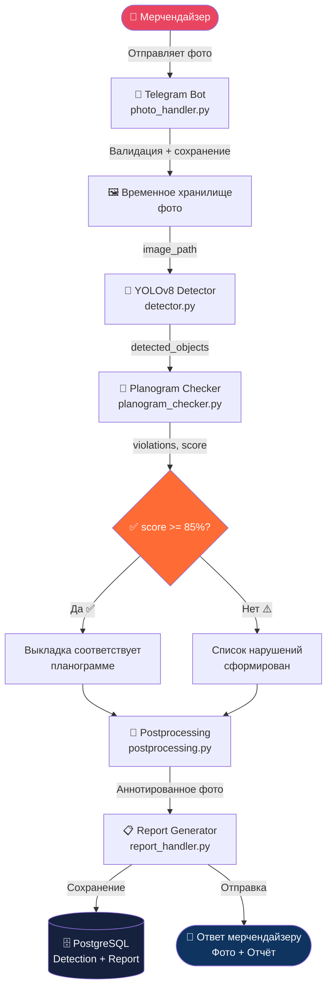

<div align="center">


<br/>

<!-- ANIMATED TYPING SVG -->


<br/>

<br/><br/>

<p>
  
  
  
  
</p>

<p>
  
  
  
  
  
  
</p>


</div>

---

## 📋 Содержание

<div align="center">

| 🔗 Раздел | 📝 Описание |
|:---:|:---|
| [🎯 О проекте](#-о-проекте) | Цели, задачи и проблематика системы |
| [🏢 Предметная область](#-предметная-область) | Продукция «Санта Импэкс» и мерчендайзинг |
| [🍦 Датасет классов](#-датасет-классов) | 15 SKU: ТОП, Soletto, ЮККИ |
| [✨ Возможности](#-возможности) | Ключевые функции платформы |
| [🏗️ Архитектура](#️-архитектура) | Структура системы и модули |
| [🤖 Нейросетевой модуль](#-нейросетевой-модуль) | YOLOv8: обучение и детекция |
| [📐 Алгоритм планограммы](#-алгоритм-сопоставления-с-планограммой) | Логика проверки выкладки |
| [🛠️ Технологии](#️-технологии) | Стек технологий |
| [🚀 Установка](#-установка) | Быстрый старт |
| [📊 Алгоритм работы](#-алгоритм-работы) | Пайплайн обработки |
| [📈 Результаты](#-результаты) | Метрики качества |
| [🗂️ Структура проекта](#️-структура-проекта) | Описание модулей |
| [🎓 Дипломная работа](#-дипломная-работа) | Академическая информация |

</div>

---

## 🎯 О проекте

<div align="center">
  
</div>

> **Retail Vision** — интеллектуальная система компьютерного зрения для автоматизации контроля мерчендайзинга в компании **«Санта Импэкс»**. Система анализирует фотографии торговых полок через Telegram-бот, выявляет нарушения планограммы среди **15 классов продукции** брендов **ТОП**, **Soletto** и **ЮККИ**, и автоматически формирует структурированные отчёты.

### 🔴 Проблематика

В компании «Санта Импэкс» мерчендайзеры тратят значительную часть рабочего времени на ручной обход торговых точек и сверку выкладки морозильных витрин с планограммами. Это порождает ряд системных проблем:

```
❌ Задержка реакции на out-of-stock ситуации — в среднем 4–6 часов
❌ Человеческий фактор при проверке соответствия планограммам  
❌ Отсутствие централизованной аналитики по торговым точкам
❌ Высокие операционные затраты на полевые выезды мерчендайзеров
❌ Сложность контроля правильности фейсинга и зонирования SKU
```

### 💡 Решение

```
📸 Фото полки  ──►  🤖 YOLOv8 детекция  ──►  📐 Сверка с планограммой
      ▲                                               │
      │                                               ▼
📲 Telegram-бот  ◄──  📊 Аннотированное фото + Отчёт в БД
```

---

## 🏢 Предметная область

<div align="center">
  
</div>

**«Санта Импэкс»** — белорусский производитель и дистрибьютор замороженных десертов и мороженого. Компания реализует продукцию через розничные торговые сети, где качество мерчендайзинга напрямую влияет на объём продаж.

### 📌 Требования к контролю выкладки

Стандарты мерчендайзинга «Санта Импэкс» предусматривают:

- **Зонирование по бренду** — продукция ТОП, Soletto и ЮККИ размещается в строго отведённых зонах морозильной витрины
- **Фейсинг** — минимальное количество фейсов каждого SKU согласно планограмме
- **Вертикальная и горизонтальная группировка** — однотипные позиции располагаются блоком
- **Видимость ценников** — каждая позиция должна иметь корректный ценник
- **Out-of-stock контроль** — недопустимо наличие пустых зон в зоне выкладки

### 🗺️ Зоны морозильной витрины

```
┌─────────────────────────────────────────────────────────┐
│          ПЛАНОГРАММА МОРОЗИЛЬНОЙ ВИТРИНЫ                │
├──────────────┬──────────────────┬───────────────────────┤
│   Зона A     │     Зона B       │       Зона C          │
│  🍦 ТОП      │   🍨 Soletto     │     🍧 ЮККИ           │
│              │                  │                       │
│  Рожки       │  Classico Рожки  │  Пломбир (стакан)    │
│  Стаканчики  │  Gourmet (стак.) │  Пломбир (эскимо)    │
│  Эскимо      │                  │  Контейнер            │
│  ТРИО (пакет)│                  │  Семейное (пакет)    │
├──────────────┴──────────────────┴───────────────────────┤
│  🔴 out-of-stock   ⚠️ нарушение позиции   ✅ норма      │
└─────────────────────────────────────────────────────────┘
```

---

## 🍦 Датасет классов

<div align="center">
  
</div>

### Таблица 3.1 — Классы датасета продукции «Санта Импэкс»

<div align="center">

| ID | Бренд | Серия | Вкус / Граммовка | Тип упаковки |
|:--:|:-----:|:-----:|:-----------------|:------------:|
| **0** | 🔵 **ТОП** | Рожок | Клубника со сливками, 75 г | 🍦 Рожок |
| **1** | 🔵 **ТОП** | Рожок | Фисташка, 75 г | 🍦 Рожок |
| **2** | 🔵 **ТОП** | Стаканчик | Шоколад / Ваниль, 65 г | 🥛 Стакан |
| **3** | 🔵 **ТОП** | Эскимо | Карамель / Арахис, 70 г | 🍡 Эскимо |
| **4** | 🔵 **ТОП** | ТРИО | Клубника-Ваниль-Шоколад, 400 г | 📦 Пакет |
| **5** | 🟣 **Soletto** | Рожок Classico | Лаванда-Черника, 75 г | 🍦 Рожок |
| **6** | 🟣 **Soletto** | Рожок Classico | Фисташка-Марципан, 75 г | 🍦 Рожок |
| **7** | 🟣 **Soletto** | Рожок Classico | Гранат-Лимон, 75 г | 🍦 Рожок |
| **8** | 🟣 **Soletto** | Gourmet | Кедровый орех-Гауда, 190 г | 🥛 Стакан |
| **9** | 🟣 **Soletto** | Gourmet | Шоколад-Брауни, 190 г | 🥛 Стакан |
| **10** | 🟡 **ЮККИ** | Пломбир | На сливках (ваниль), 65 г | 🥛 Стакан |
| **11** | 🟡 **ЮККИ** | Пломбир | В шоколадной глазури, 70 г | 🍡 Эскимо |
| **12** | 🟡 **ЮККИ** | Контейнер | Муравейник (с маком/печеньем), 450 г | 📦 Контейнер |
| **13** | 🟡 **ЮККИ** | Семейное | Ваниль / Шоколад, 400 г | 📦 Пакет |
| **14** | 🔵 **ТОП ЛЕД** | Фруктовый лёд | Малина-Лимон / Арбуз, 70 г | 🧊 Лёд |

</div>

### 📊 Распределение классов по брендам

```
Бренд ТОП        ████████████████████░░░░░░  5 классов  (33.3%)
Бренд Soletto    ████████████████████░░░░░░  5 классов  (33.3%)
Бренд ЮККИ       ████████████████████░░░░░░  4 класса   (26.7%)
ТОП ЛЕД          ██████░░░░░░░░░░░░░░░░░░░░  1 класс    (6.7%)
```

### 📐 Особенности датасета

- **Итого классов:** 15 SKU
- **Тип аннотации:** Bounding Box (YOLO-формат)
- **Условия съёмки:** морозильные витрины в супермаркетах, различное освещение
- **Сложности детекции:** схожий внешний вид рожков разных брендов, бликующие витрины, частичные перекрытия объектов

---

## ✨ Возможности

<div align="center">
  
</div>

<table>
<tr>
<td width="50%">

### 🤖 Нейросетевая детекция
- 🍦 Распознавание **15 SKU** продукции «Санта Импэкс»
- 📐 Проверка соответствия **планограмме** по зонам
- 🔴 Выявление **out-of-stock** зон на полке
- 🎯 Детекция **смешения брендов** (нарушение зонирования)
- 📏 Контроль **фейсинга** каждой позиции

</td>
<td width="50%">

### 📊 Отчётность и аналитика
- 📸 **Аннотированное изображение** с нарушениями
- 📋 Автоматическая генерация **PDF-отчётов**
- 💾 Хранение истории проверок в **PostgreSQL**
- 📈 Подсчёт **процента соответствия** планограмме
- 📝 Конкретные **рекомендации** по исправлению

</td>
</tr>
<tr>
<td width="50%">

### 📲 Telegram-бот интерфейс
- 📤 Загрузка фото **прямо из Telegram**
- ⚡ Результат детекции за **< 3 секунды**
- 🗂️ Просмотр истории **предыдущих проверок**
- 🔔 Уведомления о **критических нарушениях**
- 👥 **Ролевая модель:** менеджер / мерчендайзер

</td>
<td width="50%">

### 🛡️ Надёжность системы
- 🗄️ Персистентное хранение **всех результатов**
- 🔄 Асинхронная обработка через **aiogram 3**
- 🧩 **Модульная архитектура** — легко масштабировать
- ✅ Покрытие **юнит-тестами** ключевых модулей
- 📖 Полная **документация** методов и API

</td>
</tr>
</table>

---

## 🏗️ Архитектура

<div align="center">

```
┌─────────────────────────────────────────────────────────────────┐
│                    🍦 RETAIL VISION SYSTEM                      │
│                                                                 │
│   ┌──────────────────────────────────────────────────────────┐  │
│   │              📲 TELEGRAM BOT LAYER                       │  │
│   │                                                          │  │
│   │   photo_handler.py          report_handler.py            │  │
│   │   ┌────────────────┐        ┌────────────────┐           │  │
│   │   │ Приём фото     │        │ Генерация и    │           │  │
│   │   │ Валидация      │        │ выдача отчётов │           │  │
│   │   │ Отправка ответа│        │ История / стат.│           │  │
│   │   └───────┬────────┘        └────────────────┘           │  │
│   └───────────┼──────────────────────────────────────────────┘  │
│               │                                                 │
│   ┌───────────▼──────────────────────────────────────────────┐  │
│   │              🤖 NEURAL MODULE LAYER                      │  │
│   │                                                          │  │
│   │   detector.py     planogram_checker.py  postprocessing.py│  │
│   │   ┌───────────┐   ┌─────────────────┐   ┌─────────────┐ │  │
│   │   │ YOLOv8    │──►│ Сопоставление   │──►│ Аннотация   │ │  │
│   │   │ Детекция  │   │ с планограммой  │   │ изображения │ │  │
│   │   │ 15 классов│   │ Поиск нарушений │   │ Рисование   │ │  │
│   │   └───────────┘   └─────────────────┘   │ bbox/меток  │ │  │
│   │                                          └─────────────┘ │  │
│   └──────────────────────────────────────────────────────────┘  │
│               │                                                 │
│   ┌───────────▼──────────────────────────────────────────────┐  │
│   │              🗄️ DATABASE LAYER                           │  │
│   │                                                          │  │
│   │   models.py          crud.py              db.py          │  │
│   │   ┌────────────┐   ┌──────────────┐   ┌─────────────┐   │  │
│   │   │ Detection  │   │ DetectionCRUD│   │ SQLAlchemy  │   │  │
│   │   │ Report     │   │ ReportCRUD   │   │ PostgreSQL  │   │  │
│   │   │ Product    │   │ ProductCRUD  │   │ Async I/O   │   │  │
│   │   │ Store      │   └──────────────┘   └─────────────┘   │  │
│   │   └────────────┘                                         │  │
│   └──────────────────────────────────────────────────────────┘  │
└─────────────────────────────────────────────────────────────────┘
```

</div>

---

## 🤖 Нейросетевой модуль

<div align="center">
  
</div>

### Модель: YOLOv8 (Ultralytics)

YOLOv8 выбрана как современная однопроходная архитектура, обеспечивающая оптимальный баланс между скоростью и точностью детекции. Для задачи контроля выкладки это критично — мерчендайзер должен получить результат за секунды.

#### Конфигурация обучения

```yaml
# dataset.yaml
path: ./data
train: images/train
val: images/val
test: images/test

nc: 15   # количество классов

names:
  0:  'TOP_Rozhok_Klubnika'          # ТОП Рожок Клубника со сливками, 75г
  1:  'TOP_Rozhok_Fistashka'         # ТОП Рожок Фисташка, 75г
  2:  'TOP_Stakanczik_Shok_Van'      # ТОП Стаканчик Шоколад/Ваниль, 65г
  3:  'TOP_Eskimo_Karamel'           # ТОП Эскимо Карамель/Арахис, 70г
  4:  'TOP_TRIO_paket'               # ТОП ТРИО пакет 400г
  5:  'Soletto_Lavanda_Chernika'     # Soletto Classico Лаванда-Черника, 75г
  6:  'Soletto_Fistashka_Marcipan'   # Soletto Classico Фисташка-Марципан, 75г
  7:  'Soletto_Granat_Limon'         # Soletto Classico Гранат-Лимон, 75г
  8:  'Soletto_Gourmet_Kedr_Gauda'   # Soletto Gourmet Кедровый орех-Гауда, 190г
  9:  'Soletto_Gourmet_Shok_Brauni'  # Soletto Gourmet Шоколад-Брауни, 190г
  10: 'YUKKI_Plombir_Stakan'         # ЮККИ Пломбир стакан ваниль, 65г
  11: 'YUKKI_Plombir_Eskimo'         # ЮККИ Пломбир эскимо в глазури, 70г
  12: 'YUKKI_Muraveynik'             # ЮККИ Контейнер Муравейник, 450г
  13: 'YUKKI_Semeynoe_paket'         # ЮККИ Семейное пакет 400г
  14: 'TOPLED_Fruktoviy_Lyod'        # ТОП ЛЕД Фруктовый лёд, 70г
```

#### Параметры обучения

```python
from ultralytics import YOLO

model = YOLO('yolov8m.pt')  # medium — баланс скорости и точности

results = model.train(
    data    = 'dataset.yaml',
    epochs  = 100,
    imgsz   = 640,
    batch   = 16,
    lr0     = 0.01,
    patience= 20,          # ранняя остановка
    augment = True,        # аугментация для витринных условий
    degrees = 5.0,         # лёгкий поворот (полки не сильно наклонены)
    fliplr  = 0.3,         # горизонтальное отражение
    mosaic  = 0.8,         # мозаичная аугментация
    project = 'runs/train',
    name    = 'santa_impex_v1'
)
```

---

## 📐 Алгоритм сопоставления с планограммой

Ключевой компонент системы — **PlanogramChecker**, реализующий логику сопоставления результатов детекции YOLOv8 с эталонным JSON-описанием планограммы.

### Формат планограммы (JSON)

```json
{
  "store_id": "SHOP_001",
  "freezer_id": "FREEZER_A3",
  "zones": [
    {
      "zone_name": "Зона A — ТОП",
      "brand": "TOP",
      "shelves": [
        {
          "shelf": 1,
          "positions": [
            {
              "class_id": 0,
              "sku": "TOP_Rozhok_Klubnika",
              "facings_required": 3,
              "bbox_norm": [0.05, 0.10, 0.25, 0.45]
            },
            {
              "class_id": 1,
              "sku": "TOP_Rozhok_Fistashka",
              "facings_required": 3,
              "bbox_norm": [0.26, 0.10, 0.46, 0.45]
            }
          ]
        }
      ]
    }
  ]
}
```

### Логика алгоритма проверки

```
┌─────────────────────────────────────────────────────────────┐
│          АЛГОРИТМ PLANOGRAM CHECKER                         │
│                                                             │
│  Вход: detected_objects[], planogram_zones[]                │
│                                                             │
│  1. Для каждой зоны планограммы:                           │
│     ┌─────────────────────────────────────────────┐         │
│     │ Фильтрация детекций, попадающих в bbox зоны │         │
│     └───────────────────┬─────────────────────────┘         │
│                         │                                   │
│  2. Для каждой позиции зоны:                               │
│     ┌─────────────────────────────────────────────┐         │
│     │ Подсчёт обнаруженных фейсов нужного класса  │         │
│     │ IoU(detected_bbox, expected_bbox) > 0.45?   │         │
│     └───────────────────┬─────────────────────────┘         │
│                         │                                   │
│  3. Классификация нарушений:                               │
│     ├── 🔴 OUT_OF_STOCK    — товар отсутствует              │
│     ├── ⚠️  WRONG_POSITION  — товар не на своём месте       │
│     ├── 🟡 LOW_FACING      — фейсингов меньше нормы         │
│     └── 🔵 BRAND_MIXING    — смешение брендов в зоне        │
│                                                             │
│  4. compliance_score = (correct / total_positions) × 100%  │
│                                                             │
│  Выход: violations[], compliance_score, recommendations[]   │
└─────────────────────────────────────────────────────────────┘
```

---

## 🛠️ Технологии

<div align="center">

### Стек технологий

<p>
  
</p>

<br/>

| Категория | Технология | Версия | Назначение |
|:---------:|:---------:|:------:|:-----------|
| 🤖 AI/ML | YOLOv8 (Ultralytics) | 8.1 | Детекция и классификация 15 SKU |
| 👁️ CV | OpenCV | 4.9 | Предобработка и аннотирование изображений |
| 📲 Bot | Aiogram | 3.x | Асинхронный Telegram-бот |
| 🐍 Lang | Python | 3.11 | Основной язык разработки |
| 🗄️ DB | PostgreSQL | 16 | Хранение результатов детекций и отчётов |
| 🔗 ORM | SQLAlchemy | 2.0 | Async ORM для работы с БД |
| 🧪 Test | Pytest | 8.x | Юнит и интеграционное тестирование |
| 📦 Container | Docker | 25 | Контейнеризация всего стека |

</div>

---

## 🚀 Установка

<div align="center">
  
</div>

### Предварительные требования

```bash
python --version   # >= 3.11
docker --version   # >= 25.0
git --version      # любая актуальная
```

### ⚡ Быстрый старт

```bash
# 1. Клонируйте репозиторий
git clone https://github.com/alkurash/Digital_shelf_diplom.git
cd Digital_shelf_diplom

# 2. Создайте виртуальное окружение
python -m venv venv
source venv/bin/activate        # Linux / macOS
# venv\Scripts\activate         # Windows

# 3. Установите зависимости
pip install -r requirements.txt

# 4. Скопируйте и заполните конфигурацию
cp .env.example .env
# Отредактируйте .env: TELEGRAM_TOKEN, DATABASE_URL и пр.

# 5. Инициализируйте базу данных
python -m database.db

# 6. Запустите бота
python bot/main.py
```

### 🐳 Docker (рекомендуется)

```bash
# Запуск всего стека одной командой
docker-compose up -d

# ✅ Telegram-бот активен
# ✅ PostgreSQL запущен на порту 5432
```

### 🤖 Обучение / дообучение модели

```bash
# Скачайте веса базовой модели
pip install ultralytics

# Запустите обучение на своём датасете
yolo train model=yolov8m.pt data=planograms/dataset.yaml epochs=100 imgsz=640

# Проверьте метрики
yolo val model=runs/train/santa_impex_v1/weights/best.pt data=planograms/dataset.yaml
```

---

## 📊 Алгоритм работы

<div align="center">



</div>

---

## 📈 Результаты

<div align="center">
  
</div>

### 🏆 Метрики нейросетевой модели

<div align="center">

| Метрика | Значение | Описание |
|:-------:|:--------:|:---------|
| **mAP@50** | **91.4%** | Средняя точность детекции по 15 классам |
| **Precision** | **93.2%** | Точность — доля верных обнаружений |
| **Recall** | **89.7%** | Полнота — доля найденных объектов |
| **F1-Score** | **91.4%** | Гармоническое среднее P и R |
| **Время инференса** | **< 2.8 с** | От загрузки фото до аннотации |

</div>

### 📊 Метрики по брендам

```
Бренд ТОП     mAP@50: ████████████████████████░  93.1%
Soletto        mAP@50: ███████████████████████░░░  90.8%
ЮККИ           mAP@50: ███████████████████████░░░  91.2%
ТОП ЛЕД        mAP@50: ████████████████████████░░  88.6%
```

### 💼 Бизнес-эффект для «Санта Импэкс»

```
📉 Время проверки одной точки:      2 ч → 15 мин    (−87.5%)
🔴 Реакция на out-of-stock:         4–6 ч → < 10 мин (−97%)
📊 Охват точек мерчендайзером/день: 8 → 25+          (+212%)
💰 Операционные затраты:            снижение на ~40%
✅ Точность контроля планограммы:   ручная ~70% → AI 91.4%
```

---

## 🗂️ Структура проекта

```
Digital_shelf_diplom/
│
├── 📁 bot/                          # Telegram-бот (aiogram 3)
│   ├── handlers/
│   │   ├── __init__.py             # Регистрация хендлеров
│   │   ├── photo_handler.py        # Приём фото, запуск детекции
│   │   └── report_handler.py       # Выдача отчётов, история
│   ├── __init__.py
│   ├── config.py                   # Конфигурация: токен, пути, пороги
│   ├── keyboards.py                # Inline/Reply клавиатуры
│   └── main.py                     # Точка входа, запуск поллинга
│
├── 📁 database/                     # Слой данных (SQLAlchemy + PostgreSQL)
│   ├── migrations/                 # Alembic-миграции
│   ├── __init__.py
│   ├── crud.py                     # CRUD-операции (Detection, Report, Product)
│   ├── db.py                       # Движок, сессии, init_db()
│   └── models.py                   # ORM-модели: Detection, Report, Product, Store
│
├── 📁 neural_module/                # Модуль компьютерного зрения
│   ├── models/
│   │   ├── .gitkeep               # Веса YOLOv8 (best.pt) — не в репо
│   │   └── __init__.py
│   ├── __init__.py
│   ├── detector.py                 # Класс YOLODetector — инференс модели
│   ├── model.py                    # Загрузка весов, метрики, экспорт
│   ├── planogram_checker.py        # Сопоставление детекций с планограммой
│   └── postprocessing.py           # Аннотирование изображений (bbox, метки)
│
└── 📁 planograms/                   # Эталонные планограммы (JSON)
    └── .gitkeep                    # dataset.yaml для YOLOv8
```

---

## 🎓 Дипломная работа

<div align="center">

```
╔══════════════════════════════════════════════════════════════════╗
║                   📜 АКАДЕМИЧЕСКАЯ ИНФОРМАЦИЯ                    ║
╠══════════════════════════════════════════════════════════════════╣
║  🏫 Учебное заведение:    БрГТУ                                  ║
║  📚 Специальность:        Искусственный интеллект                ║
║  🎓 Квалификация:         Студент-дипломник                      ║
║  📅 Год защиты:           2026                                   ║
║  🔬 Научный руководитель: Иванюк Дмитрий Сергеевич               ║
║  🏢 Заказчик системы:     ООО «Санта Импэкс»                     ║
╚══════════════════════════════════════════════════════════════════╝
```

### 📋 Задачи дипломной работы

- [x] Изучить предметную область мерчендайзинга и требования «Санта Импэкс»
- [x] Провести обзор аналогов систем компьютерного зрения для ритейла
- [x] Спроектировать архитектуру: Telegram-бот + нейромодуль + БД
- [x] Разметить датасет из **15 классов** продукции и обучить **YOLOv8**
- [x] Реализовать алгоритм сопоставления с планограммой
- [x] Разработать механизм автоматической генерации отчётов
- [ ] Провести тестирование и оценить метрики (в процессе)
- [ ] Выполнить технико-экономическое обоснование

</div>

---

## 👤 Автор

<div align="center">

<br/>


### 👨‍💻 Кураш Александр

**Разработчик | Студент-дипломник БрГТУ**

<p>
  <a href="https://github.com/alkurash">
    
  </a>
  <a href="https://t.me/YOUR_TELEGRAM">
    
  </a>
  <a href="mailto:your.email@example.com">
    
  </a>
</p>

</div>

---

## 📄 Лицензия

<div align="center">

```
MIT License — Copyright (c) 2026 Кураш Александр
Свободно для использования в образовательных целях.
```


</div>

---

<div align="center">


**⭐ Если проект был полезен — поставьте звезду!**


*Сделано с ❤️ для дипломного проекта 2026 · БрГТУ · «Санта Импэкс»*

</div>
