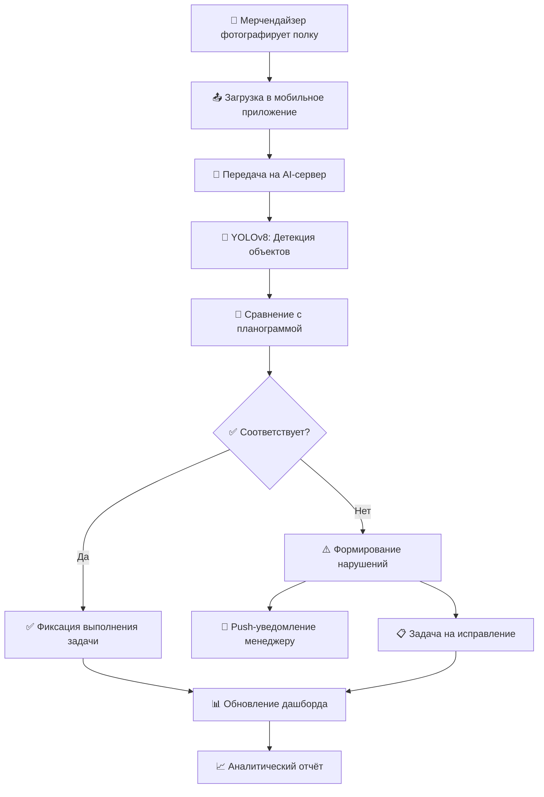

<div align="center">

<!-- ANIMATED HEADER BANNER -->


<!-- ANIMATED TYPING SVG -->
<a href="https://git.io/typing-svg">
  
</a>

<br/>

<!-- BADGES ROW 1 -->
<p>
  
  
  
  
</p>

<!-- BADGES ROW 2 — TECH STACK -->
<p>
  
  
  
  
  
  
</p>

<!-- DEMO GIF PLACEHOLDER -->
<br/>


</div>

---

## 📋 Содержание

<div align="center">

| Раздел | Описание |
|--------|----------|
| [🎯 О проекте](#-о-проекте) | Цели и задачи системы |
| [✨ Возможности](#-возможности) | Ключевые функции платформы |
| [🏗️ Архитектура](#️-архитектура) | Структура системы |
| [🛠️ Технологии](#️-технологии) | Стек технологий |
| [🚀 Установка](#-установка) | Быстрый старт |
| [📱 Скриншоты](#-скриншоты) | Интерфейс приложения |
| [📊 Алгоритм работы](#-алгоритм-работы) | Как работает система |
| [📈 Результаты](#-результаты) | Метрики и достижения |
| [🎓 Дипломная работа](#-дипломная-работа) | Информация о проекте |
| [👤 Автор](#-автор) | Контакты |

</div>

---

## 🎯 О проекте

<div align="center">
  
</div>

> **Retail Vision** — интеллектуальная система компьютерного зрения для автоматизации работы мерчендайзеров. Платформа в режиме реального времени анализирует расстановку товаров на полках, выявляет out-of-stock позиции, нарушения планограмм и формирует аналитические отчёты.

### 🎯 Проблематика

В современном ритейле мерчендайзеры тратят **до 70% рабочего времени** на ручной обход торговых точек и сверку выкладки с планограммами. Это приводит к:

- 🔴 Задержке реакции на out-of-stock ситуации (в среднем **4–6 часов**)
- 🔴 Человеческому фактору при проверке соответствия планограммам
- 🔴 Отсутствию централизованной аналитики по торговым точкам
- 🔴 Высоким операционным затратам на полевые выезды

### 💡 Решение

**Retail Vision** автоматизирует весь цикл контроля мерчендайзинга:

```
📸 Фото полки  →  🤖 AI-анализ  →  📊 Отчёт  →  📲 Уведомление мерчендайзеру
```

---

## ✨ Возможности

<div align="center">
  
</div>

<table>
<tr>
<td width="50%">

### 🔍 Компьютерное зрение
- 📦 Распознавание **товарных позиций** на полках
- 📐 Проверка соответствия **планограмме**
- 🔴 Детекция **out-of-stock** зон
- 🏷️ Считывание **ценников** и промо-материалов
- 📏 Измерение **фейсинга** каждого SKU

</td>
<td width="50%">

### 📊 Аналитика и отчётность
- 📈 Дашборд в **режиме реального времени**
- 📉 История выкладки по **торговым точкам**
- 🗺️ **Тепловые карты** полочного пространства
- 📋 Автоматическая генерация **отчётов**
- 🔔 Push-уведомления при **нарушениях**

</td>
</tr>
<tr>
<td width="50%">

### 📱 Мобильное приложение
- 📷 Съёмка полки прямо **из приложения**
- ⚡ Анализ результата за **< 3 секунды**
- 🗺️ Маршрутный лист на день
- 🔄 Offline-режим с **синхронизацией**
- ✅ Чек-листы задач мерчендайзера

</td>
<td width="50%">

### 🛡️ Управление и безопасность
- 👥 Ролевая модель: **Менеджер / Мерчендайзер**
- 🔐 JWT-авторизация
- 🏢 Мультиклиентская **архитектура**
- 📦 Управление **базой SKU** и планограммами
- 🔗 REST API для интеграции с **ERP/WMS**

</td>
</tr>
</table>

---

## 🏗️ Архитектура

<div align="center">

```
┌─────────────────────────────────────────────────────────────────┐
│                        RETAIL VISION                            │
│                                                                  │
│  ┌──────────────┐    ┌──────────────┐    ┌──────────────────┐  │
│  │  📱 Mobile   │    │  🌐 Web      │    │  🔗 External API │  │
│  │  React Native│    │  React.js    │    │  REST / Webhook  │  │
│  └──────┬───────┘    └──────┬───────┘    └────────┬─────────┘  │
│         │                   │                      │             │
│         └───────────────────┴──────────────────────┘            │
│                             │                                    │
│                    ┌────────▼────────┐                          │
│                    │  🚀 FastAPI     │                          │
│                    │  Backend Server │                          │
│                    └────────┬────────┘                          │
│                             │                                    │
│         ┌───────────────────┼───────────────────┐              │
│         │                   │                   │              │
│  ┌──────▼──────┐   ┌───────▼───────┐   ┌──────▼──────┐       │
│  │ 🤖 AI Engine│   │ 🗄️ PostgreSQL │   │ 📁 MinIO    │       │
│  │  YOLOv8 +   │   │   Database    │   │  S3 Storage │       │
│  │  OpenCV     │   │               │   │  (Images)   │       │
│  └─────────────┘   └───────────────┘   └─────────────┘       │
│                                                                  │
│  ┌────────────────────────────────────────────────────────┐    │
│  │ 🐳 Docker Compose                                       │    │
│  └────────────────────────────────────────────────────────┘    │
└─────────────────────────────────────────────────────────────────┘
```

</div>

---

## 🛠️ Технологии

<div align="center">

### Backend
<p>
  
</p>

### AI / Computer Vision
<p>
  
  
  
</p>

### Frontend & Mobile
<p>
  
</p>

### DevOps & Tools
<p>
  
</p>

</div>

<br/>

<div align="center">

| Категория | Технология | Версия | Назначение |
|-----------|-----------|--------|-----------|
| 🤖 AI/ML | YOLOv8 | 8.1 | Детекция и классификация товаров |
| 👁️ CV | OpenCV | 4.9 | Обработка изображений |
| 🚀 Backend | FastAPI | 0.111 | REST API сервер |
| 🐍 Lang | Python | 3.11 | Основной язык разработки |
| 🗄️ DB | PostgreSQL | 16 | Хранение данных |
| ⚡ Cache | Redis | 7.2 | Кеширование и очереди |
| ⚛️ Frontend | React | 18 | Веб-интерфейс |
| 📦 Container | Docker | 25 | Контейнеризация |

</div>

---

## 🚀 Установка

<div align="center">
  
</div>

### Предварительные требования

```bash
# Убедитесь, что установлены:
python --version    # >= 3.11
docker --version    # >= 25.0
node --version      # >= 20.0
```

### ⚡ Быстрый старт (Docker)

```bash
# 1. Клонируйте репозиторий
git clone https://github.com/YOUR_USERNAME/Digital_shelf_diplom.git
cd Digital_shelf_diplom

# 2. Скопируйте конфигурацию
cp .env.example .env

# 3. Запустите все сервисы одной командой
docker-compose up -d

# ✅ Приложение доступно на http://localhost:3000
# ✅ API доступен на http://localhost:8000
# ✅ Документация API: http://localhost:8000/docs
```

### 🔧 Локальная установка (dev-режим)

<details>
<summary>📦 Backend</summary>

```bash
cd backend

# Создайте виртуальное окружение
python -m venv venv
source venv/bin/activate  # Linux/Mac
# или: venv\Scripts\activate  # Windows

# Установите зависимости
pip install -r requirements.txt

# Применить миграции
alembic upgrade head

# Запустить сервер
uvicorn app.main:app --reload --port 8000
```

</details>

<details>
<summary>⚛️ Frontend</summary>

```bash
cd frontend

# Установите зависимости
npm install

# Запустите dev-сервер
npm run dev

# Сборка для продакшн
npm run build
```

</details>

<details>
<summary>🤖 AI Model</summary>

```bash
cd ai_engine

# Загрузите предобученные веса модели
python scripts/download_weights.py

# Запустите обучение (опционально)
python train.py --data dataset.yaml --epochs 100 --batch 16

# Протестируйте детекцию на изображении
python detect.py --source test_image.jpg
```

</details>

---

## 📱 Скриншоты

<div align="center">

### 🌐 Веб-дашборд


<br/><br/>

### 🤖 AI-детекция товаров

> Пример работы алгоритма распознавания на полке супермаркета

```
┌────────────────────────────────────────────────────┐
│  📸 Исходное фото          🤖 После анализа        │
│                                                      │
│  [═══════════════]    →    [▓ SKU-001 95%] ✅      │
│  [   ПОЛКА #3   ]          [▓ SKU-002 92%] ✅      │
│  [═══════════════]         [░ ПУСТО       ] 🔴      │
│  [   Товары...  ]          [▓ SKU-004 88%] ✅      │
│  [═══════════════]         [▓ SKU-005 91%] ⚠️ цена │
└────────────────────────────────────────────────────┘
```


</div>

---

## 📊 Алгоритм работы

<div align="center">



</div>

---

## 📈 Результаты

<div align="center">
  
</div>

### 🏆 Метрики модели

<div align="center">

| Метрика | Значение | Описание |
|---------|----------|----------|
| **mAP@50** | **91.4%** | Точность детекции товаров |
| **Precision** | **93.2%** | Точность классификации |
| **Recall** | **89.7%** | Полнота обнаружения |
| **FPS (GPU)** | **45 fps** | Скорость обработки видео |
| **Время анализа фото** | **< 2.8 сек** | От загрузки до результата |

</div>

### 💼 Бизнес-эффект

```
📉 Время проверки одной точки:    2 часа  →  15 минут  (-87.5%)
🔴 Время реакции на out-of-stock: 4–6 ч   →  < 10 мин  (-97%)
📊 Охват торговых точек в день:   8 магазинов → 25+     (+212%)
💰 Операционные затраты:          снижение на 40%
```

---

## 🎓 Дипломная работа

<div align="center">

```
╔══════════════════════════════════════════════════════════════╗
║                  📜 ИНФОРМАЦИЯ О ПРОЕКТЕ                     ║
╠══════════════════════════════════════════════════════════════╣
║  🏫 Учебное заведение:  [Название вашего университета]       ║
║  📚 Специальность:      [Ваша специальность]                 ║
║  🎓 Квалификация:       Бакалавр / Специалист                ║
║  📅 Год защиты:         2024                                 ║
║  🔬 Научный руководитель: [ФИО руководителя]                 ║
╚══════════════════════════════════════════════════════════════╝
```

</div>

### 📂 Структура репозитория

```
Digital_shelf_diplom/
│
├── 📁 backend/                 # FastAPI сервер
│   ├── app/
│   │   ├── api/               # Роуты и эндпоинты
│   │   ├── core/              # Настройки и конфигурация
│   │   ├── models/            # Модели БД (SQLAlchemy)
│   │   ├── schemas/           # Pydantic схемы
│   │   └── services/          # Бизнес-логика
│   └── requirements.txt
│
├── 📁 ai_engine/               # Модуль компьютерного зрения
│   ├── models/                # Веса YOLO-моделей
│   ├── inference.py           # Основной модуль детекции
│   ├── train.py               # Обучение модели
│   └── dataset.yaml           # Конфигурация датасета
│
├── 📁 frontend/                # React веб-приложение
│   ├── src/
│   │   ├── components/        # UI компоненты
│   │   ├── pages/             # Страницы
│   │   ├── hooks/             # Custom хуки
│   │   └── api/               # API клиент
│   └── package.json
│
├── 📁 mobile/                  # React Native приложение
├── 📁 docs/                    # Документация и диаграммы
├── 📁 tests/                   # Тесты
├── 🐳 docker-compose.yml
├── 📋 .env.example
└── 📖 README.md
```

---

## 👤 Автор

<div align="center">


<br/>

<!-- Замените на свои данные -->


### 👨‍💻 [Ваше Имя]

**Разработчик | Студент-дипломник**

<p>
  <a href="https://github.com/YOUR_USERNAME">
    
  </a>
  <a href="https://t.me/YOUR_TELEGRAM">
    
  </a>
  <a href="mailto:your.email@example.com">
    
  </a>
</p>

</div>

---

## 📄 Лицензия

<div align="center">

```
MIT License — Copyright (c) 2024 [Ваше Имя]
Свободно для использования в образовательных целях.
```


</div>

---

<div align="center">

<!-- FOOTER WAVE -->


**⭐ Если проект был полезен — не забудьте поставить звезду!**


*Сделано с ❤️ для дипломного проекта*

</div>
